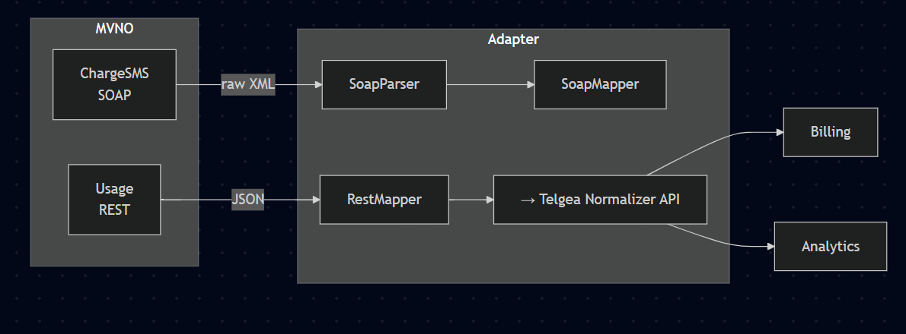

# Telgea ⇄ New MVNO Integration

## Architecture & Approach

### 1 Objectives

| Goal                             | Why it matters                                                          |
| -------------------------------- | ----------------------------------------------------------------------- |
| **Normalize MVNO data**          | Telgea’s internal systems rely on a single canonical schema.            |
| **Decouple transport & mapping** | New MVNOs (SOAP, REST, MQ, CSV…) can be plugged in with minimal change. |
| **Observability first**          | Fast diagnosis of partner issues; chargebacks depend on traceability.   |
| **Safe monetary handling**       | No floating-point drift; full-precision amounts preserved.              |

---

### 2 High-Level Flow



-   Adapters (IO) – Lightweight Express handlers (or message-queue consumers) receive partner traffic.

-   Parsers / DTOs – Convert payloads to plain TypeScript objects & validate with zod.

-   Mappers – Pure functions translate DTOs → InternalUsageRecord.

-   Sink client – Publishes the record to Telgea’s Normalizer HTTP endpoint (idempotent POST).

## Folder Layout

```
├── readMe.md # Architecture & Approach
├── src/
│   ├── adapters/
│   │   ├── rest/usageHandler.ts
│   │   └── soap/chargeSmsHandler.ts
│   ├── parsers/              # XML → DTO, JSON validation
│   ├── mappers/              # DTO → internal model
│   ├── models/               # Type & zod schemas
│   ├── utils/                # logger, config, httpClient
│   └── index.ts              # Express composition root
├── test/
│   ├── fixtures/             # sample XML/JSON
│   ├── restMapper.test.ts
│   └── soapMapper.test.ts
└── package.json / tsconfig.json / jest.config.cjs
```

### Quick Start

```bash
# 1. install
npm install

# 2. run tests
npm test           # jest green

# 3. run dev server
npm run dev        # starts Express on :4000
```
